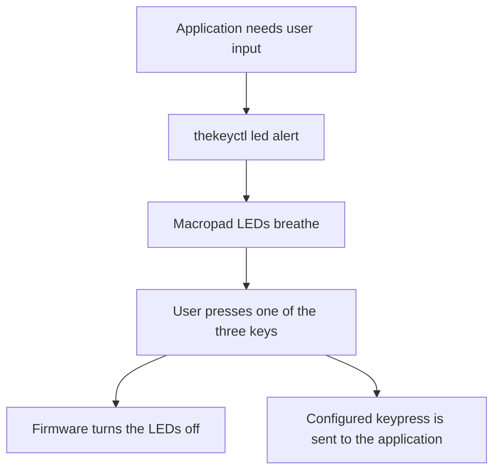
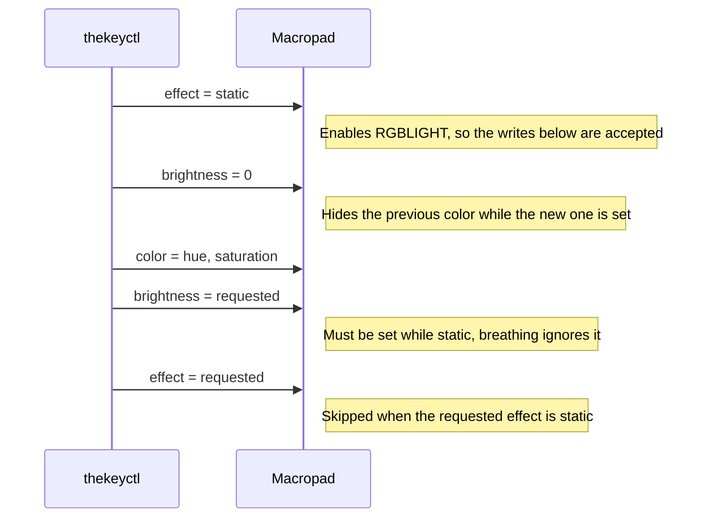

# thekeyctl

`thekeyctl` is a small Go CLI for controlling the RGB LEDs on the **Drop The Key V2** macropad.

It is intended for using the macropad as an application-attention indicator. An application can start a breathing LED alert, and pressing any of the three physical keys acknowledges the alert by turning the LEDs off while still sending the configured keypress.

The project assumes the macropad is running the custom **Vial + QMK RGBLIGHT** firmware described below.

## Features

- Control The Key V2 LEDs from the command line
- Solid-color lighting
- Breathing alert effect
- Configurable color, brightness, and breathing rate
- Turn LEDs off
- Query the current lighting state
- No background daemon required
- Key mappings are stored in the keyboard by Vial
- Pressing any macropad key automatically clears an active LED alert
- Lighting changes made by `thekeyctl` are transient and do not write to EEPROM

## Supported hardware

This project targets:

- **Drop Inc. The Key V2**
- USB VID/PID: `359b:000e`
- MCU: ATmega32U4
- Bootloader: Atmel DFU
- QMK target: `drop/thekey/v2`

After flashing the custom firmware, `lsusb` should show:

```text
ID 359b:000e Drop Inc. The Key V2
```

## CLI usage

```text
thekeyctl device info [--json]
thekeyctl status [--json]

thekeyctl led off
thekeyctl led solid [--color COLOR] [--brightness 0-255]
thekeyctl led alert [--color COLOR] [--brightness 0-255] [--rate 1-4]
```

Supported named colors: `red`, `amber`, `orange`, `yellow`, `green`, `cyan`, `blue`, `purple`, `pink`, `white`.

`device info` reports the device name, VID/PID, HID path, VIA protocol version, and whether RGBLIGHT is accessible. `status` reports the current lighting state (effect, brightness, color, speed). Both accept `--json` for machine-readable output.

Examples:

```bash
thekeyctl device info
thekeyctl device info --json

thekeyctl status
thekeyctl status --json

thekeyctl led solid --color blue --brightness 40

thekeyctl led alert

thekeyctl led alert --color red --brightness 100 --rate 2

thekeyctl led off
```

The default alert is an amber breathing effect.

When an alert is active, pressing any of the three physical keys turns the LEDs off and then processes the key normally.

## Exit codes

These codes are stable across releases and suitable for use in scripts and application integrations.

| Code | Meaning |
| --- | --- |
| 0 | Success |
| 1 | Invalid arguments or usage error |
| 2 | Device not found: macropad not connected, or custom firmware not flashed |
| 3 | Permission denied: `hidraw` node not accessible; check udev rules |
| 4 | VIA protocol mismatch: firmware uses a version this build does not support |
| 5 | HID communication failure: I/O error, timeout, or unexpected device response |

Example in a shell script:

```bash
thekeyctl led alert
status=$?

case $status in
  0) ;;                              # success
  2) echo "macropad not connected" ;;
  3) echo "check udev rules" ;;
  4) echo "firmware needs updating" ;;
  *) echo "unexpected error $status" ;;
esac
```

## Building the CLI

### Ubuntu 24.04 prerequisites

```bash
sudo apt install build-essential libudev-dev
```

The CLI uses [`github.com/sstallion/go-hid`](https://github.com/sstallion/go-hid) to communicate with the Vial/VIA Raw HID interface.

From the repository:

```bash
go mod tidy
go build -o thekeyctl .
```

Test it:

```bash
./thekeyctl status
```

Install it system-wide:

```bash
sudo install -m 0755 ./thekeyctl /usr/local/bin/thekeyctl
```

After that:

```bash
thekeyctl led alert
thekeyctl led off
```

## Linux HID permissions

The CLI needs access to the Vial Raw HID interface.

Create a udev rule specifically for The Key V2:

```bash
sudo tee /etc/udev/rules.d/59-thekeyctl.rules >/dev/null <<'EOF'
KERNEL=="hidraw*", SUBSYSTEM=="hidraw", ATTRS{idVendor}=="359b", ATTRS{idProduct}=="000e", MODE="0660", TAG+="uaccess"
EOF
```

Reload the rules:

```bash
sudo udevadm control --reload-rules
```

Then unplug and reconnect the macropad.

## Custom firmware

The stock firmware originally found on this device identified itself as:

```text
feed:6060 qmkbuilder keyboard
```

That firmware was QMK-based but was not Vial-enabled, so runtime key and RGB configuration were not available.

The custom firmware described here is based on the upstream Vial-QMK target:

```text
drop/thekey/v2
```

It adds:

- Vial runtime key mapping
- QMK RGBLIGHT support
- Static RGB lighting
- QMK breathing effect
- LEDs off by default
- Automatic clearing of active lighting when any physical key is pressed

Once this firmware is flashed, normal keymap and lighting configuration does not require reflashing.

## Building Vial-QMK firmware

### 1. Install QMK tooling

Install the required QMK tooling using the current QMK installation instructions for your Linux distribution.

Verify that the CLI is available:

```bash
qmk --version
```

### 2. Clone Vial-QMK

```bash
mkdir -p ~/Development
cd ~/Development

git clone --depth 1 --branch vial --recurse-submodules --shallow-submodules \
    https://github.com/vial-kb/vial-qmk.git

cd vial-qmk
```

Point the QMK CLI at this checkout:

```bash
qmk config user.qmk_home="$PWD"
```

Optionally create a branch for the custom firmware:

```bash
git switch -c thekey-v2-vial-rgb
```

The files modified below are under:

```text
keyboards/drop/thekey/v2/keymaps/vial/
```

### 3. Enable Vial and RGBLIGHT

Set `keyboards/drop/thekey/v2/keymaps/vial/rules.mk` to:

```make
VIA_ENABLE       = yes
VIAL_ENABLE      = yes
LTO_ENABLE       = yes

RGBLIGHT_ENABLE  = yes

# Save flash/RAM on the ATmega32U4.
QMK_SETTINGS        = no
MOUSEKEY_ENABLE     = no
TAP_DANCE_ENABLE    = no
COMBO_ENABLE        = no
KEY_OVERRIDE_ENABLE = no
CAPS_WORD_ENABLE    = no
LAYER_LOCK_ENABLE   = no
REPEAT_KEY_ENABLE   = no
```

### 4. Expose RGBLIGHT through Vial

In:

```text
keyboards/drop/thekey/v2/keymaps/vial/vial.json
```

change:

```json
"lighting": "none"
```

to:

```json
"lighting": "qmk_rgblight"
```

### 5. Configure the RGB defaults and effects

Add the following to:

```text
keyboards/drop/thekey/v2/keymaps/vial/config.h
```

```c
#define RGBLIGHT_DEFAULT_ON false
#define RGBLIGHT_DEFAULT_VAL 64

// Keep breathing; remove the other animation effects.
#undef RGBLIGHT_EFFECT_ALTERNATING
#undef RGBLIGHT_EFFECT_CHRISTMAS
#undef RGBLIGHT_EFFECT_KNIGHT
#undef RGBLIGHT_EFFECT_RAINBOW_MOOD
#undef RGBLIGHT_EFFECT_RAINBOW_SWIRL
#undef RGBLIGHT_EFFECT_RGB_TEST
#undef RGBLIGHT_EFFECT_SNAKE
#undef RGBLIGHT_EFFECT_STATIC_GRADIENT
#undef RGBLIGHT_EFFECT_TWINKLE
```

Static lighting is always available. The breathing effect remains enabled.

### 6. Turn off an active alert when a key is pressed

Replace:

```text
keyboards/drop/thekey/v2/keymaps/vial/keymap.c
```

with:

```c
// Copyright 2023 Massdrop, Inc.
// SPDX-License-Identifier: GPL-2.0-or-later

#include QMK_KEYBOARD_H

const uint16_t PROGMEM keymaps[][MATRIX_ROWS][MATRIX_COLS] = {
    [0] = LAYOUT(KC_LCTL, KC_C, KC_V)
};

bool process_record_user(uint16_t keycode, keyrecord_t *record) {
    // A physical key press acknowledges any active LED alert.
    //
    // Use the no-EEPROM version because alerts are transient state.
    // The key press itself is still processed normally because we
    // return true.
    if (record->event.pressed && rgblight_is_enabled()) {
        rgblight_disable_noeeprom();
    }

    return true;
}
```

The compiled `KC_LCTL`, `KC_C`, and `KC_V` values are only defaults. Once Vial is running, the actual key assignments can be changed dynamically and stored in the keyboard.

## Compile the firmware

Compile without flashing first:

```bash
qmk compile -kb drop/thekey/v2 -km vial
```

A known-good build of this configuration produced approximately:

```text
The firmware size is fine - 17286/28672 (60%, 11386 bytes free)
```

The exact number can vary slightly with QMK/Vial revisions.

The resulting firmware is:

```text
drop_thekey_v2_vial.hex
```

## Flashing the firmware

The Key V2 uses the Atmel DFU bootloader.

Start the flash process:

```bash
qmk flash -kb drop/thekey/v2 -km vial
```

When QMK waits for the bootloader, press the small physical reset button marked `S1` on the PCB.

If necessary:

1. Unplug the macropad.
2. Hold `S1`.
3. Plug the USB cable in.
4. Wait about a second.
5. Release `S1`.

In DFU mode, `lsusb` should normally show an ATmega32U4 DFU device such as:

```text
03eb:2ff4 Atmel Corp. ATmega32U4 DFU
```

A successful flash looks similar to:

```text
Erasing flash...  Success
Programming ...   Success
Reading ...       Success
Validating...     Success
```

After the firmware restarts:

```bash
lsusb | grep -Ei '359b|the.?key'
```

should show:

```text
359b:000e Drop Inc. The Key V2
```

The LEDs should initially be off.

## Configuring the keys with Vial

After flashing, use Vial to configure the three keys.

The browser version works in Chromium-based browsers:

- https://vial.rocks/

Authorize **Drop Inc. The Key V2**, then select each physical key and assign the desired keycode.

Vial writes keymap changes to the keyboard immediately. There is no separate Save operation.

For example, the three keys can be mapped to:

```text
Left   -> 1
Middle -> 2
Right  -> 3
```

The mappings survive unplugging, rebooting, and moving the keyboard to another computer.

Because mappings are stored in the keyboard, an OS-level remapper such as `input-remapper` is not required.

## How the alert workflow works

A typical application integration is:



No daemon is required and the CLI does not need to stay running after starting an alert.

Example from an application or shell script:

```bash
thekeyctl led alert

# Wait for / perform other application logic.
# The user's physical keypress acknowledges the alert.

thekeyctl led off
```

Calling `led off` explicitly is still useful when an application wants to cancel an outstanding alert programmatically.

## Protocol notes

`thekeyctl` talks directly to the Vial/VIA Raw HID interface exposed by the custom firmware.

For the current Vial-QMK firmware used by this project:

- Raw HID usage page: `0xff60`
- Raw HID usage: `0x0061`
- HID payload size: 32 bytes
- VIA protocol version: 9
- RGBLIGHT value IDs:
  - brightness: `0x80`
  - effect: `0x81`
  - speed: `0x82`
  - color: `0x83`

Lighting operations use QMK's non-EEPROM RGBLIGHT functions, so application alerts do not continually write transient state to the keyboard's EEPROM.

### RGBLIGHT write order

QMK silently ignores RGBLIGHT values it cannot apply to the current state, and returns a normal success response for the write regardless. Two cases matter here, both confirmed against this firmware by writing a value and reading it back:

- While RGBLIGHT is disabled, every write is dropped, including the effect mode itself. A nonzero effect write only enables RGBLIGHT, which comes up in static mode still holding the previous color. Requesting breathing mode 4 while the LEDs are off leaves the device in static mode.
- While a breathing effect is running, brightness writes are dropped.

So values cannot simply be written in the order an application thinks of them. `thekeyctl` enables the LEDs in static mode, configures them there, and switches to the requested effect last:



Getting this wrong is not a visible protocol error. It shows up as the first command after `led off` keeping the previous color, or as `led alert --brightness` having no effect.

## Source layout

The CLI is a single Go package split by layer:

| File | Contents |
| --- | --- |
| `device.go` | HID transport and the VIA protocol, plus the constants that pin both to the firmware |
| `lighting.go` | Lighting behavior: effect IDs, named colors, and the order RGBLIGHT values must be written in |
| `main.go` | Command line: usage text, flag parsing, and dispatch |

The command line is fully parsed before the device is opened, so `help`, `-h`, and argument errors work with no macropad attached.

`device` talks to the macropad through a small `transport` interface rather than the HID handle directly. The tests (`device_test.go`, `lighting_test.go`, `main_test.go`) substitute a scripted fake for it, which is why the whole suite runs without hardware.

## Development workflow

After making CLI changes:

```bash
gofmt -w <edited files>
go vet ./...
go test ./...
go build -o thekeyctl .
```

`go test ./...` does not need the macropad plugged in. To check against real hardware, run `./thekeyctl status` and the `led` commands with the macropad attached.

After making firmware changes:

```bash
cd ~/Development/vial-qmk
qmk compile -kb drop/thekey/v2 -km vial
```

Only flash after confirming the build succeeds and fits within the ATmega32U4 firmware size limit.

## Troubleshooting

### Permission denied opening the device (exit code 3)

```text
thekeyctl: opening HID device "/dev/hidraw4": permission denied (check udev rules)
```

The Raw HID interface was found, but the `hidraw` node cannot be opened. This is the udev rule, not the firmware.

Enumerating HID devices goes through udev and does not need access to the node itself, so a missing rule always surfaces at open time like this, never as a "not found" error.

Checks, in order:

```bash
ls -l /dev/hidraw*
```

The macropad's nodes should show a trailing `+` on the permissions, which is the ACL granted by `TAG+="uaccess"`:

```text
crw-rw----+ 1 root root 238, 4 /dev/hidraw4
```

If there is no `+`:

- Confirm the rule from [Linux HID permissions](#linux-hid-permissions) is installed as `/etc/udev/rules.d/59-thekeyctl.rules`.
- Reload with `sudo udevadm control --reload-rules`, then unplug and reconnect the macropad. Rules are applied on device events, so an already-connected device keeps its old permissions.
- `uaccess` grants the ACL to the user with an active local session. Over SSH there is no local seat, so use a group instead of `TAG+="uaccess"`:

  ```text
  KERNEL=="hidraw*", SUBSYSTEM=="hidraw", ATTRS{idVendor}=="359b", ATTRS{idProduct}=="000e", MODE="0660", GROUP="plugdev"
  ```

  and make sure your account is in that group.

### Vial HID interface not found (exit code 2)

```text
thekeyctl: The Key V2 Vial HID interface not found (VID=359b PID=000e usage=ff60:0061)
```

Nothing matching the macropad's Raw HID interface was enumerated. Confirm the device is connected and running the custom firmware:

```bash
lsusb | grep -Ei '359b|the.?key'
```

`359b:000e Drop Inc. The Key V2` means the firmware is right and the device is present. `feed:6060 qmkbuilder keyboard` means the stock firmware is still flashed, so there is no Vial Raw HID interface to talk to. See [Custom firmware](#custom-firmware).

### Unsupported VIA protocol version (exit code 4)

```text
thekeyctl: unsupported VIA protocol version 12; expected 9
```

The firmware was rebuilt against a Vial-QMK revision that uses a newer VIA protocol. The RGBLIGHT packet layout has to be re-checked against that version before `expectedVIAProtocol` in `device.go` is raised.

## Recovery

The hardware DFU bootloader remains available independently of the application firmware.

If a future firmware build fails to boot correctly, use the physical `S1` reset button to enter Atmel DFU mode and flash a known-good image again.

